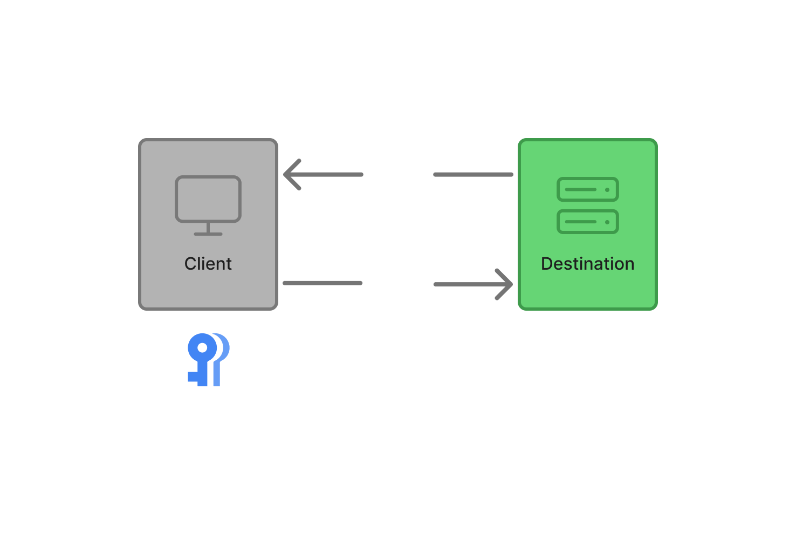
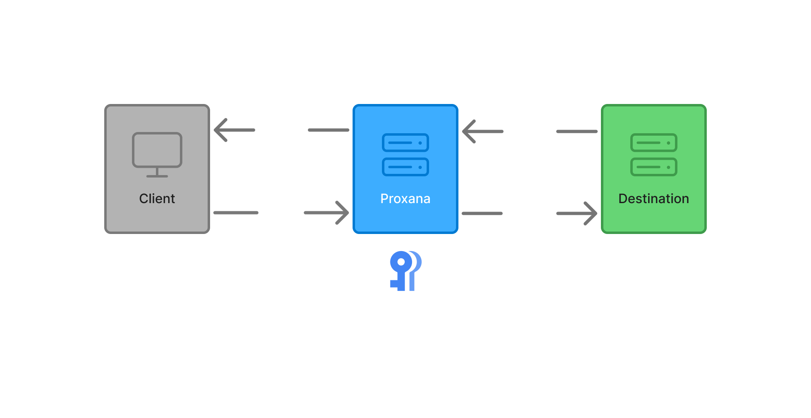

# Overview

<iframe width="100%" height="400" src="https://www.youtube.com/embed/e004VqA-6G8?si=nxSDsz_q3WpvHPqN" title="YouTube video player" frameborder="0" allow="accelerometer; autoplay; clipboard-write; encrypted-media; gyroscope; picture-in-picture; web-share" referrerpolicy="strict-origin-when-cross-origin" allowfullscreen="true"></iframe>

## How Proxana works

To use Proxana you first create and configure your proxy to target the service you want to securely use, then add your API key through our dashboard.

We encrypt your API key and store it securely, so it can be used to authenticate requests to the service.

You can then use the Proxana proxy URL in your application in place of the original service URL. Proxana will automatically inject your API key into the requests, allowing you to securely access the service without exposing your API key in your frontend code.

### Without Proxana

### With Proxana

## Benefits of using Proxana

- **Security**: Your API keys are encrypted and stored securely, reducing the risk of exposure.
- **Simplicity**: You can easily configure and manage your proxies through our dashboard.
- **Flexibility**: Proxana supports a wide range of services and can be easily integrated into your existing applications.
- **Scalability**: Proxana can handle a large number of requests, making it suitable for both small and large applications.
- **Cost-effective**: Proxana offers a free tier and competitive pricing for higher usage, making it accessible for developers and businesses of all sizes.
